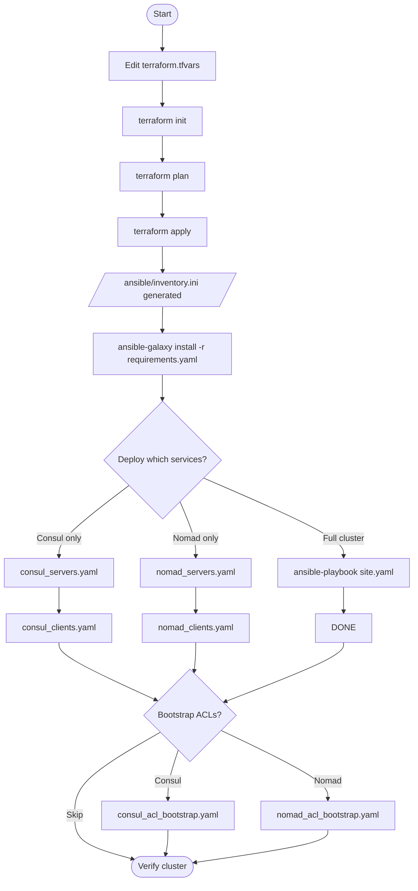

# Nomad + Consul Cluster Deployment Guide

Step-by-step instructions for deploying the co-located HashiCorp Consul v2.0.1 and Nomad v2.0.0 cluster on AWS.

## Overview

The deployment has two phases:

1. **Terraform** — Provisions AWS infrastructure (~5 minutes)
2. **Ansible** — Installs and configures Consul and Nomad (~10–15 minutes)



## Prerequisites

| Tool | Minimum version | Verify |
|------|----------------|--------|
| Terraform | 1.0 | `terraform version` |
| Ansible | 2.14 | `ansible --version` |
| AWS CLI | any | `aws sts get-caller-identity` |

Install Ansible Galaxy roles before running any playbook:

```bash
cd ansible
ansible-galaxy install -r requirements.yaml
```

## AWS Credentials

```bash
# Option 1: AWS CLI
aws configure

# Option 2: Environment variables
export AWS_ACCESS_KEY_ID="..."
export AWS_SECRET_ACCESS_KEY="..."
export AWS_DEFAULT_REGION="us-east-2"

# Option 3: Named profile
export AWS_PROFILE="your-profile-name"

# Verify
aws sts get-caller-identity
```

---

## Phase 1: Infrastructure Provisioning (Terraform)

### Step 1: Configure variables

```bash
cd terraform/aws
cp terraform.tfvars.example terraform.tfvars
```

Edit `terraform.tfvars`:

```hcl
aws_region           = "us-east-2"
project_name         = "nomad-consul"
owner                = "your-name"
environment          = "dev"

vpc_cidr             = "10.0.0.0/16"
subnet_cidr          = "10.0.1.0/24"

# ⚠️ IMPORTANT: restrict to your IP
allowed_ssh_cidr     = "YOUR_IP/32"

server_count         = 3   # Use odd numbers: 3, 5, or 7
client_count         = 2
server_instance_type = "t3.medium"
client_instance_type = "t3.medium"
```

### Step 2: Initialize Terraform

```bash
terraform init
```

Downloads the AWS, Local, Null, and TLS providers.

### Step 3: Review the execution plan

```bash
terraform plan
```

Expect ~18 resources to be created. Review instance types, counts, and security group rules before proceeding.

### Step 4: Apply

```bash
terraform apply
```

Type `yes` when prompted. Duration: ~5 minutes.

**What Terraform creates:**

| Resource | Details |
|----------|---------|
| VPC | `10.0.0.0/16`, DNS enabled |
| Public subnet | `10.0.1.0/24`, auto-assign public IPs |
| Internet gateway | Attached to VPC |
| Route table | Default route `0.0.0.0/0` → internet gateway |
| Security group | Ports 22, 8500, 4646, all-internal |
| Server EC2 instances (×3) | Ubuntu 24.04, t3.medium, 50 GB gp3, tagged `AutoJoinRole=server` |
| Client EC2 instances (×2) | Ubuntu 24.04, t3.medium, 50 GB gp3, tagged `AutoJoinRole=client` |
| IAM instance profile | `ec2:DescribeInstances` for Cloud Auto-Join |
| SSH key pair | Written to `ansible/ssh_key.pem` (mode 0600) |
| Ansible inventory | Written to `ansible/inventory.ini` |

### Step 5: Review Terraform outputs

```bash
terraform output
terraform output nomad_ui_urls
terraform output ssh_commands
```

### Step 6: Verify SSH connectivity

```bash
cd ../../ansible
ansible all -m ping
```

Expected: `pong` from all 5 hosts. If connections fail:

```bash
chmod 600 ssh_key.pem
ansible all -m ping -vvv
```

---

## Phase 2: Cluster Configuration (Ansible)

All Ansible commands are run from the `ansible/` directory with `-i inventory.ini`.

```bash
cd ansible
```

### Option A: Full cluster — Consul + Nomad in one run (recommended)

```bash
ansible-playbook -i inventory.ini site.yaml
```

`site.yaml` executes in this order:

| Step | Playbook | Hosts | What it does |
|------|----------|-------|--------------|
| 1 | `consul_servers.yaml` | `[servers]` | Installs Consul 2.0.1 in server mode, enables Cloud Auto-Join |
| 2 | `consul_clients.yaml` | `[clients]` | Installs Consul 2.0.1 in client mode, joins the server cluster |
| 3 | `nomad_servers.yaml` | `[servers]` | Installs Nomad 2.0.0 in server mode, static retry_join |
| 4 | `nomad_clients.yaml` | `[clients]` | Installs Nomad 2.0.0 in client mode, installs CNI + Docker |

Duration: ~10–15 minutes.

---

### Option B: Consul layer only

Run `consul_servers.yaml` before `consul_clients.yaml`. Clients join the server cluster at startup.

#### Install and configure Consul servers

```bash
ansible-playbook -i inventory.ini consul_servers.yaml
```

Installs on each **server** node (in role order):

1. `common` — sets hostname, installs base packages
2. `geerlingguy.docker` — installs Docker CE, adds `ubuntu` user to docker group
3. `helper` — installs apt packages: jq, net-tools, unzip, nano, curl
4. `consul` — installs Consul 2.0.1, writes `/etc/consul.d/consul.hcl`, creates systemd unit, starts service

Key configuration values applied by this playbook:

| Setting | Value |
|---------|-------|
| Mode | Server |
| `bootstrap_expect` | `{{ groups['servers'] \| length }}` |
| Datacenter | `dc1` |
| Cloud Auto-Join tag | `AutoJoinRole=server` |
| ACLs | Enabled |
| TLS | Disabled (set `consul_tls_enabled: true` to enable) |

Post-task: waits for Consul HTTP API on `127.0.0.1:8500`, then prints the UI URL.

#### Install and configure Consul clients

```bash
ansible-playbook -i inventory.ini consul_clients.yaml
```

Installs on each **client** node (same role stack as servers):

1. `common`
2. `geerlingguy.docker`
3. `helper`
4. `consul` — client mode, Cloud Auto-Join finds servers via `AutoJoinRole=server` tag

Key configuration values:

| Setting | Value |
|---------|-------|
| Mode | Client |
| Cloud Auto-Join tag | `AutoJoinRole=server` |
| ACLs | Disabled on clients by default |
| TLS | Disabled |

---

### Option C: Nomad layer only

Run after the Consul layer is up. Run `nomad_servers.yaml` before `nomad_clients.yaml`.

#### Install and configure Nomad servers

```bash
ansible-playbook -i inventory.ini nomad_servers.yaml
```

Installs on each **server** node (in role order):

1. `common` — sets hostname, installs base packages
2. `tls` — generates self-signed TLS certificates on the control machine (only when `nomad_tls_enabled: true`)
3. `helper` — installs build-essential, git, jq, net-tools, unzip, nano; copies TLS certs to `/etc/nomad.d/.tls/`
4. `nomad` — installs Nomad 2.0.0, writes `/etc/nomad.d/nomad.hcl`, creates systemd unit, starts service

Key configuration values applied by this playbook:

| Setting | Value |
|---------|-------|
| Mode | Server |
| `bootstrap_expect` | `{{ groups['servers'] \| length }}` |
| `server_join.retry_join` | Static list of server private IPs from `[servers]` inventory group |
| Cloud Auto-Join | Disabled (static join used instead) |
| ACLs | Enabled |
| TLS | Disabled (set `nomad_tls_enabled: true` to enable) |
| Log level | DEBUG |

Post-task: waits for Nomad HTTP API on port 4646.

#### Install and configure Nomad clients

```bash
ansible-playbook -i inventory.ini nomad_clients.yaml
```

Installs on each **client** node (in role order):

1. `common`
2. `cni` — installs CNI plugins (Ubuntu only)
3. `geerlingguy.docker` — installs Docker CE
4. `tls` — generates TLS certs (only when `nomad_tls_enabled: true`)
5. `helper` — installs packages; loads `bridge` kernel module; copies TLS certs
6. `nomad` — installs Nomad 2.0.0 in client mode

Key configuration values:

| Setting | Value |
|---------|-------|
| Mode | Client |
| `server_join.retry_join` | Static list of server private IPs from `[servers]` inventory group |
| Cloud Auto-Join | Disabled |
| ACLs | Enabled |
| TLS | Disabled |
| Log level | DEBUG |

Post-task: waits for Nomad HTTP API on port 4646.

---

## Phase 3: ACL Bootstrap (Optional)

Both Consul servers and all Nomad nodes have ACLs enabled by default in their playbooks. The bootstrap must be run **once**, after the cluster is first formed.

### Consul ACL bootstrap

```bash
ansible-playbook -i inventory.ini consul_acl_bootstrap.yaml
```

Targets `servers[0]` (first server only). Calls `consul acl bootstrap`, saves the management token locally (mode 0600), and exits cleanly on re-runs.

**Output files** (on the Ansible control machine):

| File | Contents |
|------|----------|
| `ansible/consul-bootstrap-token-output.txt` | Full bootstrap output + usage notes |
| `ansible/consul-bootstrap-secret-id.txt` | SecretID only, for scripting |

**Use the token:**

```bash
export CONSUL_HTTP_TOKEN=$(cat ansible/consul-bootstrap-secret-id.txt)
consul members
consul acl token read -self
```

### Nomad ACL bootstrap

```bash
ansible-playbook -i inventory.ini nomad_acl_bootstrap.yaml
```

Targets `servers[0]`. Calls `nomad acl bootstrap`, saves the management token locally (mode 0600), and exits cleanly on re-runs.

**Output files** (on the Ansible control machine):

| File | Contents |
|------|----------|
| `ansible/nomad-bootstrap-token-output.txt` | Full bootstrap output + usage notes |
| `ansible/nomad-bootstrap-secret-id.txt` | SecretID only, for scripting |

**Use the token:**

```bash
export NOMAD_TOKEN=$(cat ansible/nomad-bootstrap-secret-id.txt)
nomad server members
nomad acl token self
```

---

## Post-Deployment Verification

SSH to a server to run the verification commands:

```bash
ssh -i ansible/ssh_key.pem ubuntu@<server-public-ip>
```

### Verify Consul

```bash
# Should show 3 servers + 2 clients
consul members

# Expected output:
# Node                        Address          Status  Type    Build   Protocol  DC   Partition  Segment
# nomad-consul-server-1  10.0.1.x:8301   alive   server  2.0.1   2         dc1  default    <all>
# nomad-consul-server-2  10.0.1.y:8301   alive   server  2.0.1   2         dc1  default    <all>
# nomad-consul-server-3  10.0.1.z:8301   alive   server  2.0.1   2         dc1  default    <all>
# nomad-consul-client-1  10.0.1.a:8301   alive   client  2.0.1   2         dc1  default    <default>
# nomad-consul-client-2  10.0.1.b:8301   alive   client  2.0.1   2         dc1  default    <default>

consul info | grep -E "server|leader|peers"
```

### Verify Nomad

```bash
# Check server quorum (one node should be Leader)
nomad server members

# Expected output:
# Name                           Address     Port  Status  Leader  Raft Version  Build  DC   Region
# nomad-consul-server-1.dc1  10.0.1.x    4648  alive   false   3             2.0.0  dc1  global
# nomad-consul-server-2.dc1  10.0.1.y    4648  alive   true    3             2.0.0  dc1  global
# nomad-consul-server-3.dc1  10.0.1.z    4648  alive   false   3             2.0.0  dc1  global

# Check registered client nodes
nomad node status
```

### Access the UIs

| Service | URL |
|---------|-----|
| Consul UI | `http://<server-public-ip>:8500/ui` |
| Nomad UI | `http://<server-public-ip>:4646` |

### Run a test Nomad job

```bash
cat > example.nomad << 'EOF'
job "example" {
  datacenters = ["dc1"]
  type        = "service"

  group "web" {
    count = 2

    task "nginx" {
      driver = "docker"

      config {
        image = "nginx:latest"
        ports = ["http"]
      }

      resources {
        cpu    = 100
        memory = 128
      }
    }

    network {
      port "http" { to = 80 }
    }
  }
}
EOF

nomad job run example.nomad
nomad job status example
```

---

## Troubleshooting

### SSH connection failures

```bash
# Fix key permissions
chmod 600 ansible/ssh_key.pem

# Test manually
ssh -i ansible/ssh_key.pem ubuntu@<server-ip>

# Run Ansible with verbose output
ansible all -m ping -vvv -i ansible/inventory.ini
```

### Consul not forming a quorum

```bash
# View Consul logs on a server
sudo journalctl -u consul -n 100

# Verify the AutoJoinRole tag exists on instances
aws ec2 describe-instances \
  --filters "Name=tag:AutoJoinRole,Values=server" \
  --query 'Reservations[*].Instances[*].[InstanceId,State.Name,Tags]' \
  --output table

# Verify the IAM instance profile is attached
aws ec2 describe-instances \
  --filters "Name=tag:AutoJoinRole,Values=server" \
  --query 'Reservations[*].Instances[*].[InstanceId,IamInstanceProfile.Arn]' \
  --output table
```

### Nomad servers not forming a quorum

```bash
# View Nomad logs on a server
sudo journalctl -u nomad -n 100

# Confirm retry_join addresses are reachable from one server to another
ping <other-server-private-ip>
```

### Nomad clients not connecting to servers

```bash
# View Nomad client logs
sudo journalctl -u nomad -n 100

# Verify security group allows all internal traffic (protocol -1, self)
# This is set by network.tf and should already be correct
```

### Service not starting after config change

```bash
sudo systemctl status consul
sudo systemctl status nomad

# Follow logs in real time
sudo journalctl -u consul -f
sudo journalctl -u nomad -f
```

### Terraform: duplicate key pair error

```bash
aws ec2 delete-key-pair --key-name nomad-consul-key
# Then re-run terraform apply
```

### Terraform: InsufficientInstanceCapacity

Try a different availability zone or instance type (e.g., `t3a.medium`), or wait a few minutes and retry.

---

## Cleanup

```bash
cd terraform/aws
terraform destroy
```

Destroys all EC2 instances, VPC, IAM roles, and SSH key pairs.
