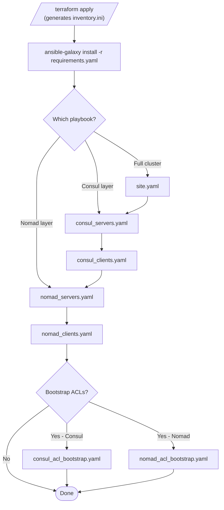

# Ansible Playbooks Reference

This directory contains Ansible playbooks for installing and configuring a co-located HashiCorp Consul v2.0.1 and Nomad v2.0.0 cluster on AWS infrastructure provisioned by Terraform.

All playbooks use the `inventory.ini` file generated by `terraform apply`. Run all commands from the `ansible/` directory.

## Playbook Dependency Order



**Rules:**

- Always run `consul_servers.yaml` before `consul_clients.yaml`.
- Always run `nomad_servers.yaml` before `nomad_clients.yaml`.
- Run the Consul layer before the Nomad layer.

---

## Playbooks

### site.yaml

Runs the full cluster in dependency order. Use this for initial deployment and subsequent full-cluster updates.

```bash
ansible-playbook -i inventory.ini site.yaml
```

Execution order:

1. Pre-tasks on all hosts — configures passwordless sudo, runs a ping check
2. `consul_servers.yaml` — Consul server agents on `[servers]`
3. `consul_clients.yaml` — Consul client agents on `[clients]`
4. `nomad_servers.yaml` — Nomad server agents on `[servers]`
5. `nomad_clients.yaml` — Nomad client agents on `[clients]`
6. Post-task summary — prints SSH commands and UI URLs for all nodes

---

### consul_servers.yaml

Installs and configures Consul server agents on the `[servers]` inventory group.

```bash
ansible-playbook -i inventory.ini consul_servers.yaml
```

**Target hosts:** `servers` | **Become:** yes | **gather_facts:** yes

**Roles applied in order:**

| Role | Purpose |
|------|---------|
| `common` | Sets hostname, installs base system packages |
| `geerlingguy.docker` | Installs Docker CE; adds `ubuntu` user to the docker group |
| `helper` | Installs apt packages: jq, net-tools, unzip, nano, curl |
| `consul` | Installs Consul 2.0.1, writes `/etc/consul.d/consul.hcl`, creates systemd unit, starts service |

**Key variables set by this playbook:**

| Variable | Value |
|----------|-------|
| `consul_server_enabled` | `true` |
| `consul_server_bootstrap_expect` | `{{ groups['servers'] \| length }}` |
| `consul_datacenter` | `dc1` |
| `consul_ui_enabled` | `true` |
| `consul_cloud_auto_join_enabled` | `true` |
| `consul_cloud_auto_join_tag_key` | `AutoJoinRole` |
| `consul_cloud_auto_join_tag_value` | `server` |
| `consul_acl_enabled` | `true` |
| `consul_tls_enabled` | `false` |

**Post-tasks:** Waits for Consul HTTP API on `127.0.0.1:8500`, then prints `http://<host>:8500/ui`.

---

### consul_clients.yaml

Installs and configures Consul client agents on the `[clients]` inventory group. Run **after** `consul_servers.yaml`.

```bash
ansible-playbook -i inventory.ini consul_clients.yaml
```

**Target hosts:** `clients` | **Become:** yes | **gather_facts:** yes

**Roles applied in order:**

| Role | Purpose |
|------|---------|
| `common` | Sets hostname, installs base system packages |
| `geerlingguy.docker` | Installs Docker CE |
| `helper` | Installs apt packages: jq, net-tools, unzip, nano, curl |
| `consul` | Installs Consul 2.0.1 in client mode, joins server cluster via Cloud Auto-Join |

**Key variables set by this playbook:**

| Variable | Value |
|----------|-------|
| `consul_server_enabled` | `false` |
| `consul_datacenter` | `dc1` |
| `consul_cloud_auto_join_enabled` | `true` |
| `consul_cloud_auto_join_tag_key` | `AutoJoinRole` |
| `consul_cloud_auto_join_tag_value` | `server` |
| `consul_acl_enabled` | `false` |
| `consul_tls_enabled` | `false` |

**Post-tasks:** Waits for Consul HTTP API on `127.0.0.1:8500`.

---

### consul_acl_bootstrap.yaml

Bootstraps the Consul ACL system. Run **once**, after `consul_servers.yaml` completes and the cluster has formed.

```bash
ansible-playbook -i inventory.ini consul_acl_bootstrap.yaml
```

**Target hosts:** `servers[0]` (first server only) | **Become:** no

**Prerequisites:** `consul_acl_enabled: true` must be set when Consul was deployed. This is the default in `consul_servers.yaml`.

**What it does:**

1. Verifies Consul is listening on port 8500.
2. Runs `consul acl bootstrap`.
3. On success: saves the management token to two local files on the Ansible control machine.
4. On re-run: detects the already-bootstrapped state and exits cleanly without error.

**Output files** (mode 0600, written to the Ansible control machine):

| File | Contents |
|------|----------|
| `ansible/consul-bootstrap-token-output.txt` | Full bootstrap output with usage notes |
| `ansible/consul-bootstrap-secret-id.txt` | SecretID only, for scripting |

**Use the token:**

```bash
export CONSUL_HTTP_TOKEN=$(cat ansible/consul-bootstrap-secret-id.txt)
consul members
consul acl token read -self
```

---

### nomad_servers.yaml

Installs and configures Nomad server agents on the `[servers]` inventory group. Run **after** the Consul layer is up.

```bash
ansible-playbook -i inventory.ini nomad_servers.yaml
```

**Target hosts:** `servers` | **Become:** yes | **gather_facts:** yes

**Roles applied in order:**

| Role | Purpose |
|------|---------|
| `common` | Sets hostname, installs base system packages |
| `tls` | Generates self-signed TLS certificates on the control machine (skipped when `nomad_tls_enabled: false`) |
| `helper` | Installs build-essential, git, jq, net-tools, unzip, nano; copies TLS certs to `/etc/nomad.d/.tls/` |
| `nomad` | Installs Nomad 2.0.0, writes `/etc/nomad.d/nomad.hcl`, creates systemd unit, starts service |

**Key variables set by this playbook:**

| Variable | Value |
|----------|-------|
| `nomad_server_enabled` | `true` |
| `nomad_server_bootstrap_expect` | `{{ groups['servers'] \| length }}` |
| `nomad_client_enabled` | `false` |
| `nomad_cloud_auto_join_enabled` | `false` |
| `nomad_acl_enabled` | `true` |
| `nomad_tls_enabled` | `false` |
| `nomad_log_level` | `DEBUG` |

**How Nomad servers discover each other:** The `nomad.hcl` template generates a static `server_join.retry_join` list using the private IP of every host in the `[servers]` inventory group. Cloud Auto-Join is not used for Nomad.

**Post-tasks:** Waits for Nomad HTTP API on port 4646.

---

### nomad_clients.yaml

Installs and configures Nomad client agents on the `[clients]` inventory group. Run **after** `nomad_servers.yaml`.

```bash
ansible-playbook -i inventory.ini nomad_clients.yaml
```

**Target hosts:** `clients` | **Become:** yes | **gather_facts:** yes

**Roles applied in order:**

| Role | Purpose |
|------|---------|
| `common` | Sets hostname, installs base system packages |
| `cni` | Installs CNI plugins (Ubuntu only) |
| `geerlingguy.docker` | Installs Docker CE |
| `tls` | Generates TLS certs (skipped when `nomad_tls_enabled: false`) |
| `helper` | Installs build-essential, git, jq, net-tools, unzip; loads `bridge` kernel module; copies TLS certs |
| `nomad` | Installs Nomad 2.0.0 in client mode, writes config, starts service |

**Key variables set by this playbook:**

| Variable | Value |
|----------|-------|
| `nomad_server_enabled` | `false` |
| `nomad_client_enabled` | `true` |
| `nomad_cloud_auto_join_enabled` | `false` |
| `nomad_acl_enabled` | `true` |
| `nomad_tls_enabled` | `false` |
| `nomad_log_level` | `DEBUG` |

**How Nomad clients find servers:** Same as servers — static `server_join.retry_join` list of server private IPs from the `[servers]` inventory group.

**Post-tasks:** Waits for Nomad HTTP API on port 4646.

---

### nomad_acl_bootstrap.yaml

Bootstraps the Nomad ACL system. Run **once**, after `nomad_servers.yaml` completes and the cluster has formed.

```bash
ansible-playbook -i inventory.ini nomad_acl_bootstrap.yaml
```

**Target hosts:** `servers[0]` (first server only) | **Become:** no

**Prerequisites:** `nomad_acl_enabled: true` must be set when Nomad was deployed. This is the default in `nomad_servers.yaml` and `nomad_clients.yaml`.

**What it does:**

1. Verifies Nomad is listening on port 4646.
2. Runs `nomad acl bootstrap`.
3. On success: saves the management token to two local files on the Ansible control machine.
4. On re-run: detects the already-bootstrapped state and exits cleanly without error.

**Output files** (mode 0600, written to the Ansible control machine):

| File | Contents |
|------|----------|
| `ansible/nomad-bootstrap-token-output.txt` | Full bootstrap output with usage notes |
| `ansible/nomad-bootstrap-secret-id.txt` | SecretID only, for scripting |

**Use the token:**

```bash
export NOMAD_TOKEN=$(cat ansible/nomad-bootstrap-secret-id.txt)
nomad server members
nomad acl token self
```

---

## Playbook Variables Reference

### Common variables (all playbooks)

| Variable | Default | Description |
|----------|---------|-------------|
| `nomad_log_level` | `DEBUG` | Nomad log level: DEBUG, INFO, WARN, ERROR |
| `consul_log_level` | `INFO` | Consul log level |

### Consul server variables (`consul_servers.yaml`)

| Variable | Default in playbook | Description |
|----------|--------------------| ------------|
| `consul_server_enabled` | `true` | Enables server mode |
| `consul_server_bootstrap_expect` | `{{ groups['servers'] \| length }}` | Quorum size |
| `consul_cloud_auto_join_enabled` | `true` | Enables AWS Cloud Auto-Join |
| `consul_acl_enabled` | `true` | Enables ACLs |
| `consul_tls_enabled` | `false` | Enables TLS |

### Nomad server variables (`nomad_servers.yaml`)

| Variable | Default in playbook | Description |
|----------|--------------------| ------------|
| `nomad_server_enabled` | `true` | Enables server mode |
| `nomad_server_bootstrap_expect` | `{{ groups['servers'] \| length }}` | Quorum size |
| `nomad_acl_enabled` | `true` | Enables ACLs |
| `nomad_tls_enabled` | `false` | Enables TLS |

---

## TLS Certificates

TLS is disabled by default. To enable it, set `nomad_tls_enabled: true` in both `nomad_servers.yaml` and `nomad_clients.yaml` before running those playbooks.

The `tls` role generates self-signed certificates on the Ansible control machine and stores them in `ansible/.tls/`:

```
ansible/.tls/
├── ca.pem                    # CA certificate
├── ca-key.pem                # CA private key (sensitive)
├── <hostname>.pem            # Per-node certificate
└── <hostname>-key.pem        # Per-node private key (sensitive)
```

The `helper` role copies these to `/etc/nomad.d/.tls/` on each node.

---

## Customization

### Change Consul or Nomad version

Edit the `defaults/main.yaml` for the relevant role:

```yaml
# ansible/roles/consul/defaults/main.yaml
consul_binary_version: "2.0.1"

# ansible/roles/nomad/defaults/main.yaml
nomad_binary_version: "2.0.0"
```

Then re-run the relevant playbook.

### Enable TLS

Add to `nomad_servers.yaml` and `nomad_clients.yaml` vars:

```yaml
vars:
  nomad_tls_enabled: true
```

### Change log level

```yaml
vars:
  nomad_log_level: "INFO"   # DEBUG, INFO, WARN, ERROR
```

### Add packages

Override `helper_apt_packages` in the playbook vars section:

```yaml
- role: helper
  vars:
    helper_apt_packages:
      - jq
      - net-tools
      - htop
      - your-package
```

---

## Troubleshooting

### community.crypto collection missing

```bash
ansible-galaxy collection install community.crypto
```

### Consul not forming a quorum

```bash
# View logs on a server
sudo journalctl -u consul -n 100 -f

# Verify the AutoJoinRole tag and IAM profile
aws ec2 describe-instances \
  --filters "Name=tag:AutoJoinRole,Values=server" \
  --query 'Reservations[*].Instances[*].[InstanceId,IamInstanceProfile.Arn,Tags]' \
  --output table
```

### Nomad servers not forming a quorum

```bash
# View Nomad logs
sudo journalctl -u nomad -n 100

# Confirm the private IPs in retry_join are reachable
cat /etc/nomad.d/nomad.hcl | grep retry_join
ping <server-private-ip>
```

### Clients not connecting to servers

```bash
sudo journalctl -u nomad -n 100
# Confirm the security group allows all internal traffic (protocol -1, self)
```

### Service failed to start after a config change

```bash
# Check for HCL syntax errors (consul and nomad validate their config before the
# Ansible handler triggers a restart, but manual checks help when debugging)
sudo consul validate /etc/consul.d/
sudo nomad config validate /etc/nomad.d/

sudo systemctl status consul
sudo systemctl status nomad
```
